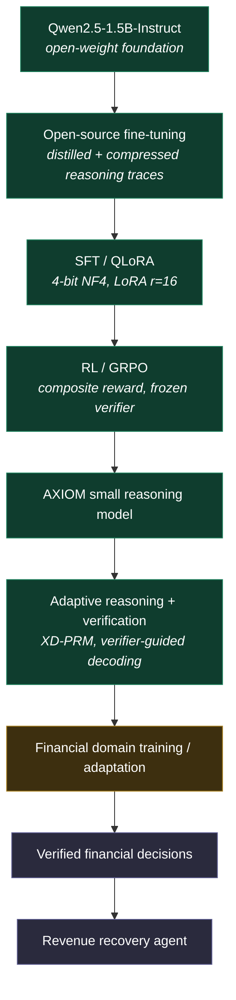
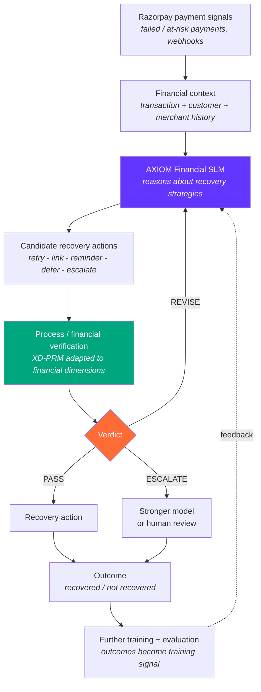

<div align="center">

# AXIOM

### The Financial Reasoning SLM

**An open-source small language model, trained by us, being specialized for verified financial
reasoning and autonomous revenue recovery.**

*From AI that can act → AI that knows when it is safe to act.*

<br>


</div>

---

## We built the model

**AXIOM is an open-source small language model and reasoning system built by fine-tuning
Qwen2.5-1.5B-Instruct.** The project combines supervised fine-tuning (SFT / QLoRA), reinforcement
learning with GRPO, adaptive reasoning depth, and process-level verification into a single trained
reasoner — not a prompt chain, not an API wrapper, and not an orchestration layer over someone
else's model.

The training stack in this repository is real and complete: a distillation and trace-compression
pipeline, a QLoRA SFT trainer, a five-head process reward model with its own automated label
foundry, a GRPO reinforcement-learning loop that optimizes against that frozen verifier, and an
inference engine that merges the trained adapters and reasons step by step under verifier guidance.

**We are now extending and training AXIOM toward financial reasoning** — where the model evaluates
financial context, reasons about candidate recovery actions, verifies its own decisions, and
supports autonomous revenue-recovery workflows on Razorpay.

> **AXIOM is the model.** The Razorpay work is the next domain-specific evolution of that model, not
> a separate product that happens to call an LLM.

### The model at a glance

| | |
|---|---|
| **Foundation** | `Qwen/Qwen2.5-1.5B-Instruct` (open-weight, Apache 2.0) |
| **Supervised fine-tuning** | QLoRA — 4-bit NF4, double quant, bfloat16 compute, LoRA r=16 / α=32, all linear layers |
| **Reinforcement learning** | GRPO (TRL) against a composite reward with a **frozen** process verifier, KL-leashed to the SFT reference |
| **Reward signal** | `R = 1.0·correctness + 0.5·R_aggregate(XD-PRM) − 0.1·length − 0.2·repetition` |
| **Verifier** | XD-PRM — backbone + domain embedding + **5 scalar heads scored per reasoning step** |
| **Inference** | Verifier-guided decoding (best-of-B step selection) + adaptive reasoning depth |
| **Training data** | Compressed reasoning traces distilled from OpenR1-Math-220k |
| **Published checkpoint** | [`prabindersinghh/axiom-qwen2.5-1.5b-reasoning`](https://huggingface.co/prabindersinghh/axiom-qwen2.5-1.5b-reasoning) |
| **Financial specialization** | **In progress — being trained/adapted. Not complete.** |

---

## What We Actually Built

Everything in this section is implemented in this repository and verifiable in the source. This is
the model and the machinery that produced it.

### The training pipeline

```
ingest → distill traces → compress → SFT (QLoRA) → PRM label foundry → XD-PRM → GRPO → eval → serve
  00          01             02          03               04              05       06     07     08
```

Nine numbered stages, each a thin CLI in [`scripts/`](scripts/) over real logic in
[`src/axiom/`](src/axiom/), driven by Hydra configs in [`configs/`](configs/).

| Stage | What we built | Implementation |
|---|---|---|
| **Reasoning-trace distillation** | Step-segmented reasoning traces from OpenR1-Math-220k, using one shared segmentation contract so training, scoring and decoding never drift | [`distill/`](src/axiom/distill/) · [`common/steps.py`](src/axiom/common/steps.py) |
| **Sparse reasoning compression** | Embedding-driven novelty pruning + token-budget cap, with an **answer-preservation check** that reverts the compression if the answer stops being derivable | [`distill/compress.py`](src/axiom/distill/compress.py) |
| **QLoRA supervised fine-tuning** | 4-bit NF4 QLoRA over TRL's `SFTTrainer` with PEFT, LoRA r=16 / α=32 on all linear layers, curriculum ordering, and a sequence-length filter that **drops** rather than silently truncates | [`sft/train_sft.py`](src/axiom/sft/train_sft.py) |
| **XD-PRM process verifier** | Backbone + domain embedding + five independent scalar heads, pooled at each step's boundary sentinel, trained with masked multi-task losses | [`prm/model.py`](src/axiom/prm/model.py) · [`prm/heads.py`](src/axiom/prm/heads.py) |
| **Automated label foundry** | Per-step labels for all five heads at near-zero annotation cost — MC rollouts, cross-encoder NLI, embedding novelty, rollout variance | [`prm/labeling/`](src/axiom/prm/labeling/) |
| **The G2 quality gate** | The verifier must prove itself on held-out data before anything may consume it; failure **raises and blocks the pipeline** | [`prm/validate.py`](src/axiom/prm/validate.py) |
| **GRPO reinforcement learning** | TRL `GRPOTrainer` with our composite reward, the verifier **frozen**, KL-leashed to the SFT reference, with periodic reward audits | [`rl/train_grpo.py`](src/axiom/rl/train_grpo.py) · [`rl/rewards.py`](src/axiom/rl/rewards.py) |
| **Verifier-guided decoding** | Sample B candidate next-steps, score each with the frozen XD-PRM, advance the best, prune the rest | [`inference/verifier_decode.py`](src/axiom/inference/verifier_decode.py) |
| **Adaptive reasoning depth** | Confidence-driven `continue / expand / exit` controller under hard depth and token caps | [`inference/adaptive_depth.py`](src/axiom/inference/adaptive_depth.py) |
| **Unified inference engine** | Merges the trained LoRA adapters into a servable policy and reasons step by step, emitting per-head telemetry | [`inference/engine.py`](src/axiom/inference/engine.py) |
| **Serving + explainability** | FastAPI + SSE streaming of live reasoning with per-step verifier scores, rendered by a React console | [`serve/`](src/axiom/serve/) · [`frontend/`](frontend/) |

### How the model was trained

| Parameter | Value |
|---|---|
| Base model | `Qwen/Qwen2.5-1.5B-Instruct` |
| SFT method | QLoRA — 4-bit NF4, double quantization, bfloat16 compute |
| LoRA config | r=16, α=32, dropout 0.05, target modules: all linear |
| SFT corpus | 38 compressed reasoning traces (from 300 OpenR1-Math-220k rows scanned) |
| GRPO | Group size G=8 (G=4 under T4 memory), KL coefficient 0.04, lr 1e-6 |
| GRPO reward | correctness 1.0 · process 0.5 · length −0.1 · repetition −0.2 |
| XD-PRM backbone | `Qwen/Qwen2.5-0.5B-Instruct` + domain embedding + 5 scalar heads |
| G2 gate thresholds | AUC ≥ 0.70 · max head correlation ≤ 0.90 · ECE ≤ 0.15 |
| Training hardware | Tesla T4 16 GB (Kaggle) — `batch_size=1`, `grad_accum=32`, `max_seq_tokens=2048` |

**A published checkpoint exists:**
[`prabindersinghh/axiom-qwen2.5-1.5b-reasoning`](https://huggingface.co/prabindersinghh/axiom-qwen2.5-1.5b-reasoning),
together with the distilled trace dataset
[`prabindersinghh/axiom-reasoning-traces`](https://huggingface.co/datasets/prabindersinghh/axiom-reasoning-traces).

### The honest status of that training run

We would rather state this plainly than have a reviewer find it themselves.

- **The training stack is complete and real.** Every stage above is implemented, tested, and
  runnable. That is the part we are confident about.
- **The training run was small.** SFT used **38 compressed traces**. A serious SFT run uses
  thousands. The corpus was throttled by a `max_reasoning_chars=6000` filter needed to exclude
  competition-length OpenR1-Math traces, which cut 300 scanned rows down to 46 usable ones.
- **The T4 forced significant compromises** — `batch_size=1`, `max_seq_tokens=2048`, and
  `rollouts_k=1` instead of 8, which degrades the Logic head from a soft value to a binary label
  and hurts calibration.
- **The repository's own notes are inconsistent about how completely the end-to-end run finished.**
  The model card describes SFT as performed and publishes a checkpoint; earlier project notes
  record dtype and bitsandbytes conflicts during the T4 run. We flag the discrepancy rather than
  resolve it in our own favour.
- **Benchmark accuracy is not measured.** See [Measured vs. not measured](#measured-vs-not-measured).

Completing a full run on adequate hardware is roadmap item 0.

---

## The Verified Financial SLM

The architectural thesis of the project, in one line:

```
   AXIOM MODEL              XD-PRM VERIFIER            FINANCIAL SPECIALIZATION
  reasoning capability   +  decision verification   +  domain capability
                                       =
                            VERIFIED FINANCIAL SLM
```

These are three separable things, and keeping them separable is the point:

| Component | What it contributes | Status |
|---|---|---|
| **AXIOM model** | The reasoning itself — a trained SLM that thinks in explicit, segmented steps | **Built** |
| **XD-PRM verifier** | An *independent* judgment on that reasoning, step by step, with authority to block it | **Built** |
| **Financial specialization** | Domain competence — payment context, recovery strategy, financial risk | **Being adapted** |

A model that reasons but cannot be checked is unsafe for money. A verifier with no model to check
is inert. A verified reasoner with no domain knowledge is generic. AXIOM's bet is that all three
have to be built together — and the first two already are.

**Crucially, the verifier is not a wrapper bolted on afterward.** In AXIOM it is the hub: the same
XD-PRM is consumed by four separate subsystems.

```
                    ┌───────────────────────────────────────────┐
                    │                 XD-PRM                     │
                    │   5 scalar heads, scored per step          │
                    └──┬────────┬────────────┬──────────────┬────┘
                       │        │            │              │
           GRPO reward │        │ decode     │ confidence   │ gate
                       ▼        ▼ score      ▼ signal       ▼
                ┌──────────┐ ┌────────┐ ┌──────────┐ ┌───────────┐
                │ RL train │ │verifier│ │ adaptive │ │  G2 gate  │
                │ (frozen  │ │ guided │ │  depth   │ │  blocks   │
                │  PRM)    │ │ decode │ │controller│ │ pipeline  │
                └──────────┘ └────────┘ └──────────┘ └───────────┘
```

### The five heads

| Head | What it scores | How it is labelled |
|---|---|---|
| **Logic** | Does this step actually follow? | Monte-Carlo rollouts — how often the prefix reaches the gold answer |
| **Commonsense** | Is this plausible in the world? | NLI entailment proxy (optional teacher judge) |
| **Consistency** | Does it contradict earlier steps? | Cross-encoder NLI against the prior prefix |
| **Efficiency** | Is this step doing new work? | Cosine novelty of the step embedding vs. priors |
| **Confidence** | How certain are we, calibrated? | Rollout answer variance / modal agreement |

---

## AXIOM as a Financial SLM

**Status: current research direction.** The reasoning model and its verifier are built. The
financial specialization is what we are training and adapting now. It is **not complete**, and
nothing below should be read as a finished capability.



<table>
<tr>
<td width="33%" valign="top">

**Built and trained**
<br><br>
Qwen2.5-1.5B foundation · trace distillation and compression · QLoRA SFT · XD-PRM verifier and
label foundry · GRPO · verifier-guided decoding · adaptive depth · inference and serving.

</td>
<td width="33%" valign="top">

**Being trained / adapted**
<br><br>
Financial domain specialization — teaching the model to reason over payment context, recovery
strategy, and financial risk, and adapting the verifier's heads to financial dimensions.

</td>
<td width="33%" valign="top">

**Planned productization**
<br><br>
Razorpay integration, the recovery action engine, the decision audit surface, and eventually the
**PMOS** merchant layer.

</td>
</tr>
</table>

> **Read this before any other section.** Every claim below is labelled **Built**, **Being
> adapted**, or **Planned**. No Razorpay integration exists in this repository today. No financial
> verifier is implemented today. No financial training results exist today. PMOS is not
> implemented. The foundation those are being built on — the trained model and its verifier — is
> what is already here.

---

## Why a Financial SLM instead of a Frontier Model?

This is the engineering hypothesis the project is built to test. It is stated as an objective, not
as a demonstrated result.

**The setting.** Financial workflows generate an enormous number of decisions. A merchant with
meaningful volume may see thousands of failed payments a month; a payment processor sees orders of
magnitude more. The overwhelming majority of those decisions are routine.

**The hypothesis:**

| Claim | Why it plausibly holds |
|---|---|
| Not every decision needs a frontier model | Most failed-payment decisions are recurring patterns, not novel reasoning problems |
| A smaller specialized model can target lower cost and latency | A 1.5B model is cheap enough to run per-decision at volume; a frontier model is not |
| Domain specialization can improve consistency | Recurring financial workflows reward a model tuned to *those* patterns over a generalist |
| Difficult and high-risk cases can be escalated | The confidence head already provides a calibrated trigger for handing off |
| Verification can gate execution | The verifier already has the authority to block a step before it becomes an action |

**AXIOM is designed toward** a tiered decision economy:

```
Routine decisions        ->  local small model, shallow reasoning       (the bulk)
Ambiguous decisions      ->  deeper adaptive reasoning + verification
High-risk / high-value   ->  escalate to a stronger model
Low confidence           ->  escalate to a human
```

The mechanisms that make this possible are already built — the small-model foundation, the
adaptive-depth controller, reasoning compression, verifier-guided decoding, and a calibrated
confidence signal. **What is not yet built is the financial policy that maps value and risk onto
those controls.** That is the current work, and we make no efficiency or cost claims until it is
measured.

---

## The Problem AXIOM Financial Targets

A failed payment is not a payment problem. It is a **decision problem**.

When a ₹12,499 charge fails, something must decide what happens next — and the right answer depends
on context the payment gateway alone does not reason over:

| The signal | The question it raises |
|---|---|
| Insufficient funds at 11pm | Retry now, or wait for a salary-cycle date? |
| A first-time customer | Is a reminder helpful, or does it read as spam? |
| A high-lifetime-value customer | Is aggressive retry worth the relationship risk? |
| A third failure this week | Is this recoverable at all, or is it churn? |
| A ₹200 failure vs a ₹120,000 failure | Should a human ever see this? |

### Why a generic LLM agent is not enough

- It produces fluent reasoning that **is not checked** before it becomes an action.
- It is **confidently wrong** in the same tone as it is confidently right.
- It has **no calibrated sense** of when to stop and ask a human.
- Its mistakes are not text. They are **money movement and customer contact**.
- Its decisions are **not auditable** step by step after the fact.

A chatbot that is wrong writes a bad sentence. A financial agent that is wrong charges the wrong
customer at the wrong moment. **The missing layer is a model that reasons in verifiable steps and a
verifier with the authority to stop it** — which is precisely what AXIOM already is, and why the
financial specialization is a model-training problem rather than a prompt-engineering one.

---

## AXIOM Financial for Revenue Recovery

**Status: target architecture.** The model and verifier layers are built; the financial layers are
the work in progress.



| Stage | What it does | Status |
|---|---|---|
| **Payment signals** | Ingest failed / at-risk payment events and failure reasons | Planned |
| **Financial context** | Assemble transaction value, failure code, customer history, timing, prior attempts | Planned |
| **AXIOM Financial SLM** | Reason over the case, allocating depth by difficulty and value | **Model built** · financial adaptation in progress |
| **Candidate actions** | Generate *multiple* strategies rather than committing to the first | Planned |
| **Financial verification** | Score the reasoning on financial dimensions, per step | Planned (adapts built XD-PRM) |
| **PASS / REVISE / ESCALATE** | Gate the action on verdict and calibrated confidence | Planned (adapts built gate + depth controller) |
| **Recovery action** | Execute the approved action against Razorpay | Planned |
| **Outcome → training** | Feed real outcomes back as further training and evaluation signal | Planned |

The verdicts:

| Verdict | Meaning | Result |
|---|---|---|
| **PASS** | Reasoning sound, risk acceptable, confidence high | Execute the action |
| **REVISE** | Reasoning weak or a dimension fails | Re-reason with the failure as feedback |
| **ESCALATE** | Low confidence, high value, or high risk | Stronger model — or a human |

### Planned financial verification dimensions

**Not implemented.** These are the financial adaptation of the five heads that exist today, using
the same architecture — independent scalar heads over a shared backbone, scored per step.

| Planned dimension | Question it answers | Closest existing head |
|---|---|---|
| **Logical validity** | Does the recovery reasoning follow from the payment facts? | Logic |
| **Financial risk** | What is the downside if this action is wrong? | *new* |
| **Policy compliance** | Does this respect merchant rules, retry limits, contact policy? | *new* |
| **Confidence** | How calibrated is this decision — should it escalate? | Confidence |
| **Expected recovery** | What is the realistic probability this recovers the payment? | *new* |
| **Customer impact** | Does this damage a relationship worth more than the transaction? | *new* |

**The principle carried over from the G2 gate:** a verifier that has not demonstrated
discrimination and calibration on held-out data does not get to approve financial actions. The
existing pipeline already refuses to proceed on a verifier that fails its thresholds. That property
is the one most worth keeping.

### Razorpay integration surface

**Status: planned. No Razorpay integration exists in this repository** — no API client, no webhook
handler, no credential handling, no payment code of any kind.

| Surface | Intended use |
|---|---|
| Payment events / webhooks | Detect failed and at-risk payments as they happen |
| Transaction context | Amount, failure code, method, timing, retry history |
| Customer context | Payment history, lifetime value, prior recovery outcomes |
| Recovery actions | Retry scheduling, payment links, reminders, UPI recovery flows |
| Test / sandbox mode | **All development and demonstration in test mode** |
| Outcome measurement | Recovery attributed back to the decision that caused it |

---

## Example Decision

**Status: product design.** This is the intended workflow, not a recorded model output. The
financial reasoning and verification layers shown here are not implemented yet.

```
INCOMING SIGNAL
  Payment        ₹12,499
  Status         failed
  Reason         insufficient_funds
  Customer       18 months active - 14 successful payments - 0 chargebacks
  Segment        high historical value
  Attempts       first failure on this invoice
  Time           23:10 IST, Tuesday
```

**Candidate strategies the model would generate:**

| # | Strategy | Reasoning sketch |
|---|---|---|
| 1 | Immediate retry | Fastest, but the balance failed 30 seconds ago — likely to fail again and burn an attempt |
| 2 | Delayed retry, aligned to salary cycle | Insufficient funds is a *timing* failure, not an intent failure |
| 3 | Payment link + targeted reminder | Gives the customer control; adds contact cost |
| 4 | Escalate to human | Reserved for high value or high ambiguity |

**Financial verification of the leading strategy (planned dimensions):**

```
Strategy 2 — delayed retry, T+2 days, with a soft reminder at T+1

  Logical validity   PASS   failure code is timing-based; delay addresses the actual cause
  Financial risk     PASS   retry cost negligible; no chargeback exposure
  Policy compliance  PASS   within retry limits; inside permitted contact window
  Expected recovery  PASS   strong prior - 14/14 historical successes
  Customer impact    PASS   one soft touch, not an aggressive sequence
  Confidence         HIGH   consistent across reasoning paths

  VERDICT: PASS  ->  schedule retry T+2, reminder T+1
```

Strategy 1 is rejected on *expected recovery* and *financial risk* — an immediate retry against a
balance that just failed is a predictable waste. The rejection is **legible**: it names the
dimension that failed and why. That auditability is the point.

Had the amount been ₹120,000, or the customer new, or the failure the third this week, the
confidence signal would drop and the same machinery would return **ESCALATE**. The system's value is
as much in the cases it refuses as the ones it approves.

---

## Productization Layer — PMOS

**Status: product vision / roadmap. Not implemented.**

PMOS (**Private Merchant Operating System**) is the eventual merchant-facing product layer that sits
*on top of* the Financial AXIOM model. It is the application surface, not the technical core.

```
        AXIOM MODEL                 trained open-source reasoning SLM        [built]
             ↓
        FINANCIAL AXIOM             domain-specialized financial reasoning   [being adapted]
             ↓
        VERIFICATION                XD-PRM + financial dimensions            [built / adapting]
             ↓
        AGENTIC FINANCIAL           verified autonomous workflows            [planned]
        WORKFLOWS
             ↓
        PMOS                        merchant experience                      [vision]
```

Once the model can make verified financial decisions, the same loop generalises across a merchant's
operations. **All of the following are planned extensions, none are implemented:**

| Direction | What it would mean |
|---|---|
| Revenue recovery | The Razorpay entry point above |
| Reconciliation | Payments matched to invoices automatically |
| Cash-flow reasoning | Forward view built from real transaction history |
| Receivables / udhaar | Informal credit tracked and chased with judgment |
| Inventory | Restock timing reasoned from demand patterns |
| Customer intelligence | Who is valuable, who is at risk |
| Business decision support | "What if I extend 30-day terms?" answered before committing |

Every one of these is a **consequential action taken on a merchant's behalf**, which is exactly why
the verified model has to come first. PMOS is not achievable by improving a chat interface. It is
achievable by making the *decisions* trustworthy — which is a model and verification problem.

**Revenue recovery is the wedge because it is where the value is immediately measurable in rupees.**

---

## Local-First Deployment

**Status: architectural design goal.** Not a guarantee, and not the headline.

The financial model and merchant intelligence layer are **being designed for local-first deployment
where practical**. A merchant's ledger, customer list and cash position are among the most sensitive
data they hold, and the intent is to keep that context under merchant control by default, escalating
only when a decision genuinely requires a stronger model and with the minimum context required.

**What makes this plausible today:** the entire pipeline runs on **open-weight models** with no
proprietary API required — Qwen2.5, Phi-4-mini / Phi-3-mini, all-MiniLM-L6-v2, and a cross-encoder
NLI model. The one optional paid path is a teacher judge for commonsense labels, which is capped and
falls back to a free NLI proxy without an API key. A 1.5B model is small enough for local execution
to be realistic at all — which is itself an argument for the SLM approach.

**What is explicitly not claimed:** zero data transfer, regulatory compliance, production-grade
security, or any audited privacy guarantee. Those require implementation and proof that do not exist
here.

---

## Measured vs. Not Measured

We separate these deliberately.

### Measured

| Result | Value | Scope — read this |
|---|---|---|
| Token reduction from sparse compression | **59.5%** | Measured on **46 GSM8K traces** on a Kaggle T4, answer-preservation check passing. A real measurement on a small corpus — not a benchmark-scale result. |

### Not measured

- **Benchmark accuracy on GSM8K / MMLU / StrategyQA is not measured.** Earlier project documents
  carried figures for these. Those were **architecture-predicted estimates** derived from the
  literature on comparable GRPO and PRM work — not experimental results — and they are **not
  reported as results here**.
- **XD-PRM AUC and ECE are not confirmed measurements.** `AUC ≥ 0.70` and `ECE ≤ 0.15` are **gate
  thresholds enforced in code** ([`prm/validate.py`](src/axiom/prm/validate.py)), not observed
  outcomes.
- **No financial training results, financial benchmarks, recovery rates, or Razorpay metrics exist
  of any kind.** The financial specialization is in progress.

### Known limitations

- Training corpus was **38 traces** for SFT. This is very small, and we say so rather than let a
  reviewer discover it.
- Full training run pending adequate hardware (L4 / A100); T4 forced `batch_size=1`,
  `max_seq_tokens=2048`, `rollouts_k=1`.
- `rollouts_k=1` degrades the Logic head from a soft value to a binary label, hurting calibration.
- OpenR1-Math-220k traces are long and competition-level; the `max_reasoning_chars=6000` filter cut
  300 scanned rows to 46 usable traces.
- vLLM is unstable on Kaggle T4 (CUDA 12.1); the `HFEngine` fallback is slower and loses KV-cache
  reuse during GRPO sampling.
- The cross-domain claim is architecturally supported but **not yet demonstrated empirically**.
- No LICENSE file is currently present in this repository.

---

## What We Are Building Next

| # | Roadmap item | Depends on |
|---|---|---|
| **0** | Complete the training run on adequate hardware and measure real benchmark numbers | L4 / A100 access |
| **1** | **Financial reasoning corpus** — build the training data that specializes AXIOM for payment and recovery reasoning | — |
| **2** | **Financial domain training** — SFT + GRPO adaptation of the AXIOM model toward financial decisions | 1 |
| **3** | **Financial verification layer** — the six financial dimensions, adapting the existing head architecture and gate discipline | XD-PRM (built) |
| **4** | **Razorpay test integration** — sandbox events, context retrieval, action execution | 2 |
| **5** | **Recovery action engine** — retry scheduling, payment links, reminders, deferral, escalation routing | 3, 4 |
| **6** | **Evaluation framework** — recovery rate, escalation rate, unsafe decisions, auditability, latency | 5 |
| **7** | **PMOS merchant layer** — generalise the verified loop beyond recovery | 6 |

Items 1–6 are the Razorpay scope. Item 7 is the longer product direction.

### How we intend to evaluate

No results exist yet. When they do, we intend to report all of the following — including the ones
that make us look bad:

| Metric | Why it matters |
|---|---|
| Revenue at risk | The denominator — what was in play |
| Recovered revenue | The number that actually matters |
| Recovery rate | Recovered ÷ at risk |
| Verified actions | How many actions passed verification before executing |
| Escalation rate | How often the system correctly declined to act alone |
| Action latency | Whether verification is fast enough to be operationally real |
| **Unsafe / incorrect decisions** | **Actions that should not have been approved** |
| **Auditability** | Whether every decision can be reconstructed step by step |

The last two matter most for a verification project. A system that recovers more revenue while
occasionally doing something indefensible has not solved the problem it claims to solve. **We will
not report any of these numbers until they are measured.**

---

## Research Foundation — Original AXIOM

**AXIOM was not built for Razorpay.** It began as an open-source reasoning-SLM research project —
model training, reinforcement learning, and process verification — and that history is exactly why
the financial direction is credible rather than speculative. The financial work is a *specialization
of a model we already trained*, not a new idea wearing a model's clothes.

> **Original AXIOM** — *Adaptive eXplainable Intelligence for Optimized Micro-Reasoning*
>
> A cross-domain, verifier-centric framework that turns Small Language Models into efficient,
> self-checking, adaptive reasoners. A single process reward model (XD-PRM) scores every reasoning
> step on five axes and acts as the hub for reinforcement learning, verifier-guided decoding, and an
> adaptive-depth controller.

The progression:

```
Original AXIOM      open-source reasoning SLM + training + verification research
       ↓
Current evolution   financial specialization of that model
       ↓
Razorpay            first high-impact application for verified financial agents
```

- **Built for** Samsung ennovateX AX Hackathon 2026, Problem Statement 06 — *Enhancing Reasoning in
  Small Language Models (SLMs) using Reinforcement Learning*
- **Team** AXIOM — Prabinder Singh, Anish Grover
- **Institute** Thapar Institute of Engineering & Technology, Patiala, Punjab — 147004
- **Original repository** https://github.com/anishgrover72-droid/axiom
- **Demo video** https://youtu.be/xdE6rI9mULU?si=v4dzUQCTxAbbht6g

### Original contributions

The five-head cross-domain process reward model (**XD-PRM**) and its **MC-rollout label foundry**;
**sparse reasoning compression** with an answer-preservation guarantee; the **composite-reward GRPO**
loop; and the **verifier-guided adaptive-depth** decoder.

### Team

| | Member 1 | Member 2 |
|---|---|---|
| **Name** | Prabinder Singh | Anish Grover |
| **College** | Thapar Institute of Engineering & Technology, Patiala | Thapar Institute of Engineering & Technology, Patiala |
| **Roll No.** | 1024180012 | 1024060170 |
| **Email** | psingh16_be24@thapar.edu | agrover_be24@thapar.edu |
| **Degree & Dept.** | B.Tech CSBS | B.Tech ECE |
| **Year** | 2nd Year | 2nd Year |

**This repository is the financial-specialization track of that work.** The research foundation and
its authorship stand as they are.

### Models and datasets

**Foundation and supporting models** (all open-weight, Apache 2.0 / MIT):
[Qwen2.5-1.5B-Instruct](https://huggingface.co/Qwen/Qwen2.5-1.5B-Instruct) (**the base model we
fine-tuned**) ·
[Qwen2.5-7B-Instruct](https://huggingface.co/Qwen/Qwen2.5-7B-Instruct) ·
[Qwen2.5-0.5B-Instruct](https://huggingface.co/Qwen/Qwen2.5-0.5B-Instruct) (XD-PRM backbone) ·
[Phi-4-mini-instruct](https://huggingface.co/microsoft/Phi-4-mini-instruct) ·
[Phi-3-mini-4k-instruct](https://huggingface.co/microsoft/Phi-3-mini-4k-instruct) ·
[all-MiniLM-L6-v2](https://huggingface.co/sentence-transformers/all-MiniLM-L6-v2) ·
[nli-deberta-v3-base](https://huggingface.co/cross-encoder/nli-deberta-v3-base)

**Published by us** —
[prabindersinghh/axiom-qwen2.5-1.5b-reasoning](https://huggingface.co/prabindersinghh/axiom-qwen2.5-1.5b-reasoning) (model) ·
[prabindersinghh/axiom-reasoning-traces](https://huggingface.co/datasets/prabindersinghh/axiom-reasoning-traces) (dataset)

**Datasets used** —
[GSM8K](https://huggingface.co/datasets/openai/gsm8k) ·
[MMLU](https://huggingface.co/datasets/cais/mmlu) ·
[StrategyQA](https://huggingface.co/datasets/ChilleD/StrategyQA) ·
[AQuA-RAT](https://huggingface.co/datasets/deepmind/aqua_rat) ·
[ARC-Challenge](https://huggingface.co/datasets/allenai/ai2_arc) ·
[CommonsenseQA](https://huggingface.co/datasets/tau/commonsense_qa) ·
[OpenBookQA](https://huggingface.co/datasets/allenai/openbookqa) ·
[OpenR1-Math-220k](https://huggingface.co/datasets/open-r1/OpenR1-Math-220k) (trace source)

---

## Repository Layout

```
axiom/
├── configs/          Hydra config groups (all tunables; ablations via CLI override)
│   ├── model/        qwen2_5_0_5b · qwen2_5_1_5b · qwen2_5_7b · phi4_mini · phi3_mini
│   ├── data/         gsm8k · mmlu · strategyqa · aqua_rat · arc_challenge · commonsense_qa · ...
│   ├── prm/          xdprm.yaml    (5-head config, gate thresholds, loss weights)
│   ├── grpo/         composite reward, group size, KL coefficient
│   ├── sft/          lora.yaml     (r=16, alpha=32, curriculum, max_seq_tokens)
│   ├── distill/      compress.yaml (novelty_threshold=0.92, target_ratio=0.6)
│   ├── eval/         suite.yaml
│   └── infer/        engine.yaml   (verifier decode, adaptive depth thresholds)
├── src/axiom/
│   ├── common/       steps · answers · tokens · vllm_pool · seed · logging · io · hf · embed
│   ├── data/         schemas · loaders · difficulty
│   ├── distill/      generate · sources · compress · teacher
│   ├── sft/          train_sft
│   ├── prm/          heads · model · dataset · train_prm · score · validate · labeling/
│   ├── rl/           rewards · train_grpo
│   ├── inference/    adaptive_depth · verifier_decode · engine
│   ├── eval/         benchmarks · metrics · run_eval
│   └── serve/        app · stream · demo
├── scripts/          00_download_data → 08_serve
├── frontend/         React + Vite explainability console
├── notebooks/        kaggle_run.ipynb · colab_run.ipynb · RERUN.md
├── tests/            33 contract tests
└── docs/             architecture · ax · tech-stack · installation · user-guide · features
```

---

## Quickstart

### Use the published model

```python
from transformers import AutoModelForCausalLM, AutoTokenizer

model_id = "prabindersinghh/axiom-qwen2.5-1.5b-reasoning"
tokenizer = AutoTokenizer.from_pretrained(model_id)
model = AutoModelForCausalLM.from_pretrained(model_id, device_map="auto")
```

### CPU — tests only, no GPU

```bash
git clone https://github.com/prabindersinghh/axiom-verified-revenue-autopilot.git axiom && cd axiom
python -m venv .venv && source .venv/bin/activate     # Windows: .venv\Scripts\activate
pip install -e .
pytest -m "not slow" -q
```

### GPU — train the model yourself

```bash
pip install vllm && pip install -e . && pip install -r requirements.txt
python -m scripts.00_download_data data=gsm8k
python -m scripts.01_build_traces  data=gsm8k distill.source.limit=300
python -m scripts.02_compress      data=gsm8k
python -m scripts.03_sft           model=qwen2_5_1_5b
python -m scripts.04_prm_label     model=qwen2_5_1_5b
python -m scripts.05_prm_train     model=qwen2_5_1_5b
python -m scripts.06_grpo          model=qwen2_5_1_5b grpo.train.steps=150
python -m scripts.07_eval          model=qwen2_5_1_5b eval.limit=200
```

See [docs/installation.md](docs/installation.md) for the full guide, or
[notebooks/kaggle_run.ipynb](notebooks/kaggle_run.ipynb) for the T4 reproduction path.

### Reasoning console

```bash
make serve                                     # FastAPI on :8000
cd frontend && npm install && npm run dev      # console on :5173
```

Streams live per-step reasoning with the five head scores, the aggregate reward, and the
adaptive-depth decisions. Falls back to a labelled sample trace when no GPU backend is running.

---

## Documentation

[Architecture](docs/architecture.md) · [Features](docs/features.md) ·
[Tech stack & OSS](docs/tech-stack.md) · [Installation](docs/installation.md) ·
[User guide](docs/user-guide.md) · [Agentic AI & open-weight usage](docs/ax.md) ·
[Model card](hf_model_card.md) · [Dataset card](hf_dataset_card.md) ·
[Engineering charter](CLAUDE.md) · [Full design](PLAN.md)

---

<div align="center">

**We are not wrapping a frontier model around Razorpay.**

We built an open-source reasoning SLM. We fine-tuned Qwen2.5-1.5B with QLoRA SFT and GRPO.
We built process-level verification around it. Now we are specializing that model for financial
reasoning and using it to build verified autonomous financial agents.

<br>

*AXIOM is evolving from an open-source reasoning SLM into a domain-specialized Financial SLM
for verified autonomous financial decisions.*

</div>
