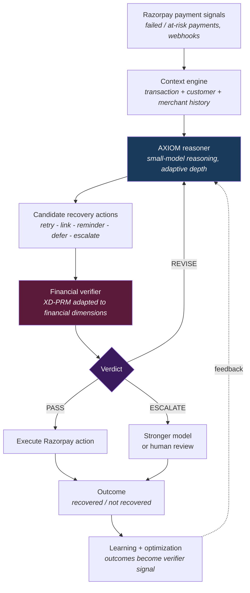

<div align="center">

# AXIOM

### Verified Revenue Autopilot

**A local-first intelligence and verification layer for autonomous financial agents.**

*Don't just let AI recover revenue. Make sure it knows why it should act.*

<br>


</div>

---

## What this is

AXIOM is a **reasoning and verification framework for small language models**, built around a
five-head cross-domain process reward model (**XD-PRM**) that scores *every reasoning step* before
that reasoning is trusted.

That framework already exists in this repository. It was built to make small models reason
*correctly, compactly and self-checkingly* — with a verifier in the loop at training time, at
decoding time, and at inference time.

**We are now extending it into a control layer for autonomous financial agents**, starting with
**revenue recovery on Razorpay**.

> **The thesis**
>
> Payment infrastructure is becoming agentic. Agents will soon retry charges, issue payment links,
> message customers and move money on a merchant's behalf.
>
> The hard part is no longer *acting*. It is knowing **when it is safe to act**.
>
> AXIOM is the reasoning, verification, confidence-gating and escalation layer that sits between an
> agent's intent and a consequential financial action.

```
      PAYMENT INFRASTRUCTURE          (Razorpay)
                 +
        FINANCIAL AGENTS              (detect, decide, act)
                 +
   AXIOM REASONING + VERIFICATION     (this repository)
                 =
   TRUSTWORTHY AUTONOMOUS REVENUE RECOVERY
```

<table>
<tr>
<td width="33%" valign="top">

**Built**
<br><br>
The AXIOM reasoning + verification framework: XD-PRM, label foundry, compression, GRPO,
verifier-guided decoding, adaptive depth, SSE serving.

</td>
<td width="33%" valign="top">

**Building**
<br><br>
The financial layer: payment context, financial verification dimensions, recovery action
engine, Razorpay sandbox integration.

</td>
<td width="33%" valign="top">

**Vision**
<br><br>
**PMOS** — a Private Merchant Operating System where a merchant talks naturally and verified
agents run the business.

</td>
</tr>
</table>

> **Read this before any other section.** Everything below is explicitly labelled **Built**,
> **Building**, or **Planned**. No Razorpay integration exists in this repository today. No
> financial verifier is implemented today. PMOS is not implemented. Those are the roadmap — the
> foundation they are being built on is what is already here.

---

## The Problem

A failed payment is not a payment problem. It is a **decision problem**.

When a ₹12,499 charge fails, something has to decide what happens next — and the right answer
depends on context the payment gateway alone does not reason over:

| The signal | The question it raises |
|---|---|
| Insufficient funds at 11pm | Retry now, or wait for a salary-cycle date? |
| A first-time customer | Is a reminder helpful, or does it read as spam? |
| A high-lifetime-value customer | Is aggressive retry worth the relationship risk? |
| A third failure this week | Is this recoverable at all, or is it churn? |
| A ₹200 failure vs a ₹120,000 failure | Should a human ever see this? |

Get it right and revenue returns. Get it wrong and you have annoyed a good customer, burned a
retry, triggered a bank flag, or silently written off recoverable money.

### Why an ordinary LLM agent is not enough

Handing this to a generic LLM agent with tool access creates a **new trust problem**:

- It produces fluent reasoning that **is not checked** before it becomes an action.
- It is **confidently wrong** in the same tone as it is confidently right.
- It has **no calibrated sense** of when it should stop and ask a human.
- Its mistakes are not text. They are **money movement, customer contact, and reputational damage**.
- Its decisions are **not auditable** step by step after the fact.

A chatbot that is wrong writes a bad sentence. A financial agent that is wrong charges the wrong
customer at the wrong moment.

**The missing layer is verification** — an independent judgment on *the reasoning itself*, before
the action is allowed to execute.

---

## The Core Idea

```
Detect → Understand → Reason → Generate strategies → VERIFY → Act → Measure → Improve
                                                       ▲
                                                       │
                                       the step everyone else skips
```

An agent detects a failed or at-risk payment, understands the transaction and customer context,
generates *candidate* recovery strategies, reasons through them — and then, critically, **a
separate verifier scores that reasoning** before anything executes.

The verifier returns one of three verdicts:

| Verdict | Meaning | Result |
|---|---|---|
| **PASS** | Reasoning is sound, risk acceptable, confidence high | Execute the action |
| **REVISE** | Reasoning is weak or a dimension fails | Re-reason with the failure as feedback |
| **ESCALATE** | Low confidence, high value, or high risk | Hand to a stronger model — or to a human |

This is not a safety wrapper bolted on afterward. In AXIOM the verifier is the **hub**: it is
already consumed by four separate subsystems in this repository.

---

## Why AXIOM

**Status: Built.** Everything in this section exists in this repository today.

AXIOM was built as a **verifier-centric** framework for small language models. Its central claim is
that a process-level verifier — one that scores *each reasoning step* rather than only the final
answer — can be reused as the reward signal, the decoding guide, and the confidence source at once.

### XD-PRM — the five-head cross-domain process verifier

A backbone model plus a domain embedding plus **five independent scalar heads**, reading the pooled
hidden state at each step's boundary sentinel:

| Head | What it scores | Label source in the foundry |
|---|---|---|
| **Logic** | Does this step actually follow? | Monte-Carlo rollouts — how often the prefix reaches the gold answer |
| **Commonsense** | Is this plausible in the world? | NLI entailment proxy (optional teacher judge) |
| **Consistency** | Does it contradict earlier steps? | Cross-encoder NLI against the prior prefix |
| **Efficiency** | Is this step doing new work? | Cosine novelty of the step embedding vs. priors |
| **Confidence** | How certain are we, calibrated? | Rollout answer variance / modal agreement |

Implemented in [`src/axiom/prm/`](src/axiom/prm/) — heads, model, dataset, scoring, and the
[label foundry](src/axiom/prm/labeling/).

### The verifier is reused four times

This is the architectural point, and it is why the framework transfers to financial decisions:

```
                    ┌───────────────────────────────────────────┐
                    │                 XD-PRM                     │
                    │   5 scalar heads, scored per step          │
                    └──┬────────┬────────────┬──────────────┬────┘
                       │        │            │              │
           GRPO reward │        │ decode     │ confidence   │ gate
                       ▼        ▼ score      ▼ signal       ▼
                ┌──────────┐ ┌────────┐ ┌──────────┐ ┌───────────┐
                │ RL train │ │verifier│ │ adaptive │ │  G2 gate  │
                │ (frozen  │ │ guided │ │  depth   │ │  blocks   │
                │  PRM)    │ │ decode │ │controller│ │ pipeline  │
                └──────────┘ └────────┘ └──────────┘ └───────────┘
```

1. **Composite-reward GRPO** — `R = 1.0·correctness + 0.5·R_aggregate − 0.1·length − 0.2·repetition`.
   Verifiable correctness dominates so the policy cannot win by gaming the learned reward; the
   length and repetition terms are explicit anti-reward-hacking guards. The PRM is **frozen** during
   RL. ([`src/axiom/rl/rewards.py`](src/axiom/rl/rewards.py))

2. **Verifier-guided decoding** — sample *B* candidate next-steps, score each with the frozen
   XD-PRM, advance the best, prune the rest, and keep the survivors for the explainability view.
   ([`src/axiom/inference/verifier_decode.py`](src/axiom/inference/verifier_decode.py))

3. **Adaptive-depth controller** — the confidence head's uncertainty drives a
   `continue / expand / exit` decision, so easy questions exit early and hard ones get more
   compute, under a hard depth and token cap.
   ([`src/axiom/inference/adaptive_depth.py`](src/axiom/inference/adaptive_depth.py))

4. **The G2 gate** — the verifier must *prove itself* on a held-out split before anything is allowed
   to consume it. Thresholds are enforced in code, and failure raises and blocks the pipeline:
   `AUC ≥ 0.70`, `max pairwise head correlation ≤ 0.90`, `ECE ≤ 0.15`.
   ([`src/axiom/prm/validate.py`](src/axiom/prm/validate.py))

### Why this matters for finance

Read the same capabilities again as financial primitives:

| AXIOM capability | Financial-agent equivalent |
|---|---|
| Step-level verification | Check the *reasoning* behind a money decision, not just its output |
| Calibrated confidence head | A principled trigger for **when to escalate to a human** |
| Adaptive reasoning depth | Spend compute on the ₹120,000 case, not the ₹200 one |
| Hard quality gate | Refuse to deploy a verifier that has not proven itself |
| Reasoning compression | Lower cost per decision at portfolio scale |
| Small-model foundation | Economics that survive millions of decisions |

The framework was not built for payments. But a process verifier that gates consequential steps is
exactly the primitive that agentic finance is missing.

---

## AXIOM for Revenue Recovery

**Status: Building.** This is the target architecture. The AXIOM layers are built; the financial
layers are the work.



### Stage by stage

| Stage | What it does | Status |
|---|---|---|
| **Payment signals** | Ingest failed / at-risk payment events and their failure reasons | Planned |
| **Context engine** | Assemble transaction value, failure code, customer history, timing, prior attempts | Planned |
| **AXIOM reasoner** | Reason over the case, allocating depth by difficulty and value | **Built** (framework) — financial adaptation planned |
| **Candidate actions** | Generate *multiple* strategies rather than committing to the first | Planned |
| **Financial verifier** | Score the reasoning on financial dimensions, per step | Planned (adapts built XD-PRM) |
| **PASS / REVISE / ESCALATE** | Gate the action on verdict and calibrated confidence | Planned (adapts built gate + depth controller) |
| **Razorpay action** | Execute the approved recovery action | Planned |
| **Outcome + learning** | Record what actually happened; feed it back as signal | Planned |

The novel part is not the loop. It is that **the verifier is independent of the reasoner** and has
the authority to block it.

---

## Financial Action Verification

**Status: Planned.** These dimensions are the financial adaptation of the five heads that exist
today. **They are not implemented in this repository yet.**

AXIOM's existing verifier scores reasoning on logic, commonsense, consistency, efficiency and
confidence. The financial verifier applies the same *architecture* — independent scalar heads over a
shared backbone, scored per step — to dimensions that matter for money:

| Planned dimension | Question it answers | Closest existing head |
|---|---|---|
| **Logical validity** | Does the recovery reasoning actually follow from the payment facts? | Logic |
| **Financial risk** | What is the downside if this action is wrong? | *new* |
| **Policy compliance** | Does this respect merchant rules, retry limits, contact policy? | *new* |
| **Confidence** | How calibrated is this decision — should it escalate? | Confidence |
| **Expected recovery** | What is the realistic probability this recovers the payment? | *new* |
| **Customer impact** | Does this damage a relationship worth more than the transaction? | *new* |

**The gating principle carried over from the G2 gate:** a verifier that has not demonstrated
discrimination and calibration on held-out data does not get to approve financial actions. The
existing pipeline already refuses to proceed on a verifier that fails its thresholds. That property
is the one most worth keeping.

---

## Example Decision

**Status: Product design.** This is the intended workflow, not a recorded system output. The
financial reasoning and verification layers described here are not implemented yet.

```
INCOMING SIGNAL
  Payment        ₹12,499
  Status         failed
  Reason         insufficient_funds
  Customer       18 months active - 14 successful payments - 0 chargebacks
  Segment        high historical value
  Attempts       first failure on this invoice
  Time           23:10 IST, Tuesday
```

**Candidate strategies generated by the reasoner:**

| # | Strategy | Reasoning sketch |
|---|---|---|
| 1 | Immediate retry | Fastest, but the balance failed 30 seconds ago — likely to fail again and burn an attempt |
| 2 | Delayed retry, aligned to salary cycle | Insufficient funds is a *timing* failure, not an intent failure |
| 3 | Payment link + targeted reminder | Gives the customer control; adds contact cost |
| 4 | Escalate to human | Reserved for high value or high ambiguity |

**Financial verification of the leading strategy (planned dimensions):**

```
Strategy 2 — delayed retry, T+2 days, with a soft reminder at T+1

  Logical validity   PASS   failure code is timing-based; delay addresses the actual cause
  Financial risk     PASS   retry cost negligible; no chargeback exposure
  Policy compliance  PASS   within retry limits; inside permitted contact window
  Expected recovery  PASS   strong prior - 14/14 historical successes
  Customer impact    PASS   one soft touch, not an aggressive sequence
  Confidence         HIGH   consistent across reasoning paths

  VERDICT: PASS  ->  schedule retry T+2, reminder T+1
```

Strategy 1 is rejected on *expected recovery* and *financial risk* — an immediate retry against a
balance that just failed is a predictable waste. Note that the rejection is **legible**: it names
the dimension that failed and why. That auditability is the point.

Had the amount been ₹120,000, or the customer new, or the failure the third this week, the
confidence signal would drop and the same machinery would return **ESCALATE** instead. The system's
value is as much in the cases it refuses as the ones it approves.

---

## PMOS — Private Merchant Operating System

**Status: Vision.** Not implemented. This is the broader product direction that the same verified
intelligence layer eventually enables.

Revenue recovery is the entry point, not the ceiling. The same reason → verify → act loop
generalises to the rest of a merchant's operations.

The eventual vision is an operating system for a micro-business where the merchant simply
**communicates naturally** and verified agents handle the operations behind it:

| Direction | What it would mean |
|---|---|
| Bookkeeping | Records updated from natural description, not forms |
| Reconciliation | Payments matched to invoices automatically |
| Receivables / udhaar | Informal credit tracked and chased with judgment |
| Revenue recovery | The Razorpay entry point above |
| Cash-flow forecasting | Forward view built from real transaction history |
| Inventory forecasting | Restock timing from demand patterns |
| Payment reminders | Sent with context and timing, not on a blind schedule |
| Customer intelligence | Who is valuable, who is at risk |
| Business simulation | "What if I extend 30-day terms?" answered before committing |
| Verified business history | A track record built from verified events |

Every one of these is a **consequential action taken on a merchant's behalf**, which is precisely
why the verification layer has to come first. PMOS is not achievable by making the chat interface
better. It is achievable by making the *decisions* trustworthy.

**Revenue recovery is the wedge because it is the one where the value is immediately measurable in
rupees.**

---

## Local-First Privacy

**Status: Architecture goal.** Framed as a design direction, not a guarantee. No privacy,
compliance, or security property is certified or proven in this repository.

A merchant's transaction ledger, customer list and cash position are among the most sensitive data
they hold. The architectural intent is to keep that context under merchant control by default:

```
Merchant business context   ->  kept local by default
          |
AXIOM reasoning             ->  run locally where the small-model foundation allows
          |
Escalation                  ->  only when the decision genuinely needs a stronger model,
                                and with the minimum context required
```

**What supports this direction today:** the pipeline runs entirely on **open-weight models** with no
proprietary API required — Qwen2.5, Phi-4-mini / Phi-3-mini, all-MiniLM-L6-v2, and a cross-encoder
NLI model. The one optional paid path is a teacher judge for commonsense labels, which is capped and
falls back to a free NLI proxy when no API key is present. The framework is small-model-first by
construction, which is what makes local execution plausible at all.

**What is explicitly not claimed:** zero data transfer, regulatory compliance, production-grade
security, or an audited privacy guarantee. Those require implementation and proof that do not exist
here yet.

---

## Why Small-Model Reasoning Matters

This is not a cost footnote. At payment-portfolio scale it is the difference between a viable system
and a demo.

**The economics.** A merchant with meaningful volume may see thousands of failed payments a month.
Routing every one through a frontier model is not economically sensible — and the overwhelming
majority of those decisions are routine.

**The AXIOM answer, already built into the framework:**

| Mechanism | Effect | Status |
|---|---|---|
| Small-model foundation (0.5B–7B) | Low cost and latency per decision | **Built** |
| Adaptive-depth controller | Easy cases exit early; hard cases get more compute | **Built** |
| Reasoning compression | Fewer tokens per trace with an answer-preservation check | **Built** |
| Verifier-guided decoding | Better output per unit of compute via best-of-B pruning | **Built** |
| Confidence-triggered escalation | Frontier models and humans reserved for cases that need them | **Built** (as a controller) · financial policy planned |

The tiered picture the financial layer is aiming at:

```
Routine decisions        ->  local small model, shallow reasoning       (the bulk)
Ambiguous decisions      ->  deeper adaptive reasoning + verification
High-risk / high-value   ->  escalate to a stronger model
Low confidence           ->  escalate to a human
```

The adaptive-depth controller exists and works on reasoning benchmarks. **Applying it to a
value-and-risk-aware financial escalation policy is roadmap work, not something the repository does
today.**

---

## Razorpay Integration Vision

**Status: Planned. No Razorpay integration exists in this repository.** There is no Razorpay API
client, no webhook handler, no credential handling, and no payment code of any kind today.

The intended integration surface:

| Surface | Intended use | Status |
|---|---|---|
| Payment events / webhooks | Detect failed and at-risk payments as they happen | Planned |
| Transaction context | Amount, failure code, method, timing, retry history | Planned |
| Customer context | Payment history, lifetime value, prior recovery outcomes | Planned |
| Recovery actions | Retry scheduling, payment links, reminders, UPI recovery flows | Planned |
| Test / sandbox mode | **All development and demonstration in test mode** | Planned |
| Outcome measurement | Recovery attributed back to the decision that caused it | Planned |

**Development principle:** every recovery action is executed against **test/sandbox credentials**
until the verification layer has demonstrated its behaviour. The system is being built so that the
verifier can block an action — which only means something if the action was genuinely going to
execute.

---

## Demo / Evaluation

**Status: Planned evaluation design. No results exist yet — none of the metrics below have been
measured.**

The intended demonstration: process a batch of failed and at-risk payments end to end and show, for
each one, the reasoning, the verification verdict, the action taken, and the outcome.

**Metrics we intend to report — honestly, including the ones that make us look bad:**

| Metric | Why it matters |
|---|---|
| Revenue at risk | The denominator — what was in play |
| Recovered revenue | The number that actually matters |
| Recovery rate | Recovered ÷ at risk |
| Verified actions | How many actions passed verification before executing |
| Escalation rate | How often the system correctly declined to act alone |
| Action latency | Whether verification is fast enough to be operationally real |
| Unsafe / incorrect decisions | **Actions that should not have been approved** |
| Auditability | Whether every decision can be reconstructed step by step |

The last two are the ones that matter for a verification project. A system that recovers more
revenue while occasionally doing something indefensible has not solved the problem it claims to
solve. **We will not report any of these numbers until they are measured.**

---

## What Exists Today

Strictly what is in this repository. Nothing in this section is aspirational.

### Implemented

| Component | Location | What it is |
|---|---|---|
| **XD-PRM** | [`src/axiom/prm/`](src/axiom/prm/) | Backbone + domain embedding + 5 scalar heads, pooled at step sentinels, with masked multi-task losses |
| **Label foundry** | [`src/axiom/prm/labeling/`](src/axiom/prm/labeling/) | MC rollouts, NLI consistency, embedding novelty, rollout-variance confidence, optional teacher judge |
| **G2 gate** | [`src/axiom/prm/validate.py`](src/axiom/prm/validate.py) | Held-out AUC / head-correlation / ECE gate that raises and blocks downstream use |
| **Sparse compression** | [`src/axiom/distill/compress.py`](src/axiom/distill/compress.py) | Novelty-threshold pruning + token-budget cap + answer-preservation revert |
| **QLoRA SFT** | [`src/axiom/sft/`](src/axiom/sft/) | 4-bit NF4 fine-tuning, LoRA r=16, curriculum ordering, sequence-length filtering |
| **Composite-reward GRPO** | [`src/axiom/rl/`](src/axiom/rl/) | TRL GRPO with correctness + PRM + length + repetition terms, frozen verifier |
| **Verifier-guided decoding** | [`src/axiom/inference/verifier_decode.py`](src/axiom/inference/verifier_decode.py) | Best-of-B step selection with PRM scoring and candidate pruning |
| **Adaptive depth** | [`src/axiom/inference/adaptive_depth.py`](src/axiom/inference/adaptive_depth.py) | `continue / expand / exit` on confidence-head uncertainty, plus a self-consistency signal |
| **Shared contracts** | [`src/axiom/common/`](src/axiom/common/) | One definition each of step segmentation, answer matching, token counting, rollout engine, schemas |
| **Serving** | [`src/axiom/serve/`](src/axiom/serve/) | FastAPI + SSE streaming of steps with per-head scores and depth decisions |
| **Explainability UI** | [`frontend/`](frontend/) | React + Vite console rendering the live reasoning ledger and verifier telemetry |
| **Pipeline CLIs** | [`scripts/`](scripts/) | `00_download_data` → `08_serve`, thin CLIs over `src/` |
| **Config system** | [`configs/`](configs/) | Hydra config groups; ablations are CLI overrides, not code edits |
| **Tests** | [`tests/`](tests/) | 33 contract tests across segmentation, answers, metrics, schemas, compression, labels |

### Measured

| Result | Value | Scope — read this |
|---|---|---|
| Token reduction from sparse compression | **59.5%** | Measured on **46 GSM8K traces** on a Kaggle T4, with the answer-preservation check passing. A real measurement on a small corpus — not a benchmark-scale result. |

### Not measured

**This is important and we state it plainly.** The training pipeline was **not fully completed** on
the available hardware. A Kaggle T4 (16 GB) required aggressive adaptations — `batch_size=1`,
`max_seq_tokens=2048`, `rollouts_k=1` instead of 8 — and dtype / bitsandbytes conflicts prevented SFT
and PRM labeling from completing end to end.

Consequently:

- **Downstream benchmark accuracy on GSM8K / MMLU / StrategyQA is not measured.** Earlier versions of
  this README carried projected figures derived from the literature. They were architecture-predicted
  estimates, not experimental results, and they are **not reported as results here**.
- **XD-PRM AUC and ECE are not confirmed measurements.** The values `AUC ≥ 0.70` and `ECE ≤ 0.15` are
  **gate thresholds enforced in code**, not observed outcomes.
- No financial, recovery, or Razorpay metric of any kind exists.

Establishing these numbers on adequate hardware is roadmap item 0.

### Known limitations

- Training incomplete on T4; benchmark deltas pending an L4 / A100 run.
- `rollouts_k=1` degrades the Logic head from a soft value to a binary label, hurting calibration.
- OpenR1-Math-220k traces are long and competition-level; the `max_reasoning_chars=6000` filter
  reduced 300 scanned rows to **46 usable traces**. The SFT corpus is small.
- vLLM is unstable on Kaggle T4 (CUDA 12.1); the `HFEngine` fallback is slower and loses KV-cache
  reuse during GRPO sampling.
- The cross-domain claim is architecturally supported but **not yet demonstrated empirically** across
  domains.
- No LICENSE file is currently present in this repository.

---

## What We Are Building Next

| # | Roadmap item | Depends on |
|---|---|---|
| **0** | Complete the training pipeline on adequate hardware and measure real benchmark numbers | L4 / A100 access |
| **1** | **Financial context layer** — assemble transaction, customer and merchant history into a reasoning-ready case | — |
| **2** | **Financial verification layer** — the six financial dimensions, adapting the existing head architecture and gate discipline | XD-PRM (built) |
| **3** | **Razorpay test integration** — sandbox events, context retrieval, action execution | 1 |
| **4** | **Recovery action engine** — retry scheduling, payment links, reminders, deferral, escalation routing | 2, 3 |
| **5** | **Decision dashboard** — per-decision audit trail: reasoning, verdict, action, outcome | 4 |
| **6** | **Evaluation framework** — the metrics above, measured on a realistic failed-payment batch | 4 |
| **7** | **PMOS merchant layer** — generalise the verified loop beyond recovery | 5, 6 |

Items 1–6 are the Razorpay buildathon scope. Item 7 is the longer product direction.

---

## Research Foundation — Original AXIOM

**AXIOM was not built for Razorpay.** It was built as a reasoning-in-small-models research project,
and that history is the reason the financial layer is credible rather than speculative.

> **Original AXIOM** — *Adaptive eXplainable Intelligence for Optimized Micro-Reasoning*
>
> A cross-domain, verifier-centric framework that turns Small Language Models into efficient,
> self-checking, adaptive reasoners. A single process reward model (XD-PRM) scores every reasoning
> step on five axes and acts as the hub for reinforcement learning, verifier-guided decoding, and an
> adaptive-depth controller.

- **Built for** Samsung ennovateX AX Hackathon 2026, Problem Statement 06 — *Enhancing Reasoning in
  Small Language Models (SLMs) using Reinforcement Learning*
- **Team** AXIOM — Prabinder Singh, Anish Grover
- **Institute** Thapar Institute of Engineering & Technology, Patiala, Punjab — 147004
- **Original repository** https://github.com/anishgrover72-droid/axiom
- **Demo video** https://youtu.be/xdE6rI9mULU?si=v4dzUQCTxAbbht6g

### Original contributions

The five-head cross-domain process reward model (**XD-PRM**) and its **MC-rollout label foundry**;
**sparse reasoning compression** with an answer-preservation guarantee; the **composite-reward GRPO**
loop; and the **verifier-guided adaptive-depth** decoder.

### Team

| | Member 1 | Member 2 |
|---|---|---|
| **Name** | Prabinder Singh | Anish Grover |
| **College** | Thapar Institute of Engineering & Technology, Patiala | Thapar Institute of Engineering & Technology, Patiala |
| **Roll No.** | 1024180012 | 1024060170 |
| **Email** | psingh16_be24@thapar.edu | agrover_be24@thapar.edu |
| **Degree & Dept.** | B.Tech CSBS | B.Tech ECE |
| **Year** | 2nd Year | 2nd Year |

**This repository is the Razorpay productization track of that work**, extending the existing
framework toward verified financial decision-making. The research foundation and its authorship
stand as they are.

### Models and datasets

**Models used** (all open-weight, Apache 2.0 / MIT):
[Qwen2.5-1.5B-Instruct](https://huggingface.co/Qwen/Qwen2.5-1.5B-Instruct) (student) ·
[Qwen2.5-7B-Instruct](https://huggingface.co/Qwen/Qwen2.5-7B-Instruct) ·
[Qwen2.5-0.5B-Instruct](https://huggingface.co/Qwen/Qwen2.5-0.5B-Instruct) (XD-PRM backbone) ·
[Phi-4-mini-instruct](https://huggingface.co/microsoft/Phi-4-mini-instruct) ·
[Phi-3-mini-4k-instruct](https://huggingface.co/microsoft/Phi-3-mini-4k-instruct) ·
[all-MiniLM-L6-v2](https://huggingface.co/sentence-transformers/all-MiniLM-L6-v2) ·
[nli-deberta-v3-base](https://huggingface.co/cross-encoder/nli-deberta-v3-base)

**Published** —
[prabindersinghh/axiom-qwen2.5-1.5b-reasoning](https://huggingface.co/prabindersinghh/axiom-qwen2.5-1.5b-reasoning) ·
[prabindersinghh/axiom-reasoning-traces](https://huggingface.co/datasets/prabindersinghh/axiom-reasoning-traces)

**Datasets** —
[GSM8K](https://huggingface.co/datasets/openai/gsm8k) ·
[MMLU](https://huggingface.co/datasets/cais/mmlu) ·
[StrategyQA](https://huggingface.co/datasets/ChilleD/StrategyQA) ·
[AQuA-RAT](https://huggingface.co/datasets/deepmind/aqua_rat) ·
[ARC-Challenge](https://huggingface.co/datasets/allenai/ai2_arc) ·
[CommonsenseQA](https://huggingface.co/datasets/tau/commonsense_qa) ·
[OpenBookQA](https://huggingface.co/datasets/allenai/openbookqa) ·
[OpenR1-Math-220k](https://huggingface.co/datasets/open-r1/OpenR1-Math-220k) (trace source)

---

## Repository Layout

```
axiom/
├── configs/          Hydra config groups (all tunables; ablations via CLI override)
│   ├── model/        qwen2_5_0_5b · qwen2_5_1_5b · qwen2_5_7b · phi4_mini · phi3_mini
│   ├── data/         gsm8k · mmlu · strategyqa · aqua_rat · arc_challenge · commonsense_qa · ...
│   ├── prm/          xdprm.yaml    (5-head config, gate thresholds, loss weights)
│   ├── grpo/         composite reward, group size, KL coefficient
│   ├── sft/          lora.yaml     (r=16, alpha=32, curriculum, max_seq_tokens)
│   ├── distill/      compress.yaml (novelty_threshold=0.92, target_ratio=0.6)
│   ├── eval/         suite.yaml
│   └── infer/        engine.yaml   (verifier decode, adaptive depth thresholds)
├── src/axiom/
│   ├── common/       steps · answers · tokens · vllm_pool · seed · logging · io · hf · embed
│   ├── data/         schemas · loaders · difficulty
│   ├── distill/      generate · sources · compress · teacher
│   ├── sft/          train_sft
│   ├── prm/          heads · model · dataset · train_prm · score · validate · labeling/
│   ├── rl/           rewards · train_grpo
│   ├── inference/    adaptive_depth · verifier_decode · engine
│   ├── eval/         benchmarks · metrics · run_eval
│   └── serve/        app · stream · demo
├── scripts/          00_download_data → 08_serve
├── frontend/         React + Vite explainability console
├── notebooks/        kaggle_run.ipynb · colab_run.ipynb · RERUN.md
├── tests/            33 contract tests
└── docs/             architecture · ax · tech-stack · installation · user-guide · features
```

---

## Quickstart

### CPU — tests only, no GPU

```bash
git clone https://github.com/prabindersinghh/axiom-verified-revenue-autopilot.git axiom && cd axiom
python -m venv .venv && source .venv/bin/activate     # Windows: .venv\Scripts\activate
pip install -e .
pytest -m "not slow" -q
```

### GPU — full pipeline

```bash
pip install vllm && pip install -e . && pip install -r requirements.txt
python -m scripts.00_download_data data=gsm8k
python -m scripts.01_build_traces  data=gsm8k distill.source.limit=300
python -m scripts.02_compress      data=gsm8k
python -m scripts.03_sft           model=qwen2_5_1_5b
python -m scripts.04_prm_label     model=qwen2_5_1_5b
python -m scripts.05_prm_train     model=qwen2_5_1_5b
python -m scripts.06_grpo          model=qwen2_5_1_5b grpo.train.steps=150
python -m scripts.07_eval          model=qwen2_5_1_5b eval.limit=200
```

See [docs/installation.md](docs/installation.md) for the full guide, or
[notebooks/kaggle_run.ipynb](notebooks/kaggle_run.ipynb) for the T4 reproduction path.

### Reasoning console

```bash
make serve                                     # FastAPI on :8000
cd frontend && npm install && npm run dev      # console on :5173
```

The frontend falls back to a labelled sample trace when no GPU backend is running.

---

## Documentation

[Architecture](docs/architecture.md) · [Features](docs/features.md) ·
[Tech stack & OSS](docs/tech-stack.md) · [Installation](docs/installation.md) ·
[User guide](docs/user-guide.md) · [Agentic AI & open-weight usage](docs/ax.md) ·
[Engineering charter](CLAUDE.md) · [Full design](PLAN.md)

---

<div align="center">

**AXIOM** — reasoning and verification for autonomous financial agents.

*From AI that can act → AI that knows when it is safe to act.*

</div>
